HW01

Реквизиты:

Windows 10
VSCodeUserSetup-x64-1.100.2
Hyper-V Версия: 10.0.19041.1
Ubuntu-24.04.2-live-server-amd64
PostgreSQL 17.5
WSL Ubuntu 20.04.1 LTS - не конфликтует с виртуальной машиной созданной на Hyper-V (встроенный гипервизор Windows)

Start:

pg_lsclusters --- проверим есть ли сущестующие кластеры

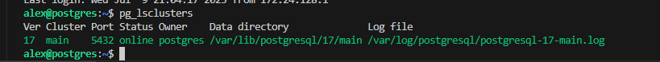

sudo su postgres --- перключаемся на пользователя postgres

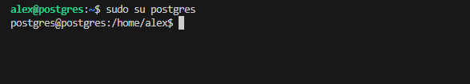

1. Выполнить pgbench-c8 -P 6 -T 60 -U postgres postgres.

pgbench  -i postgres ---инициализация (initialization) тестовой базы данных для последующего benchmarking'а с помощью утилиты pgbench. (Создает 4 таблицы)

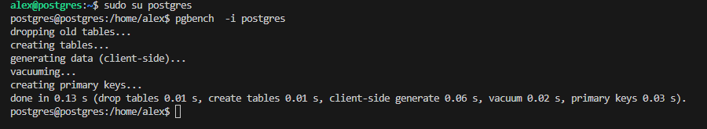

pgbench -c8 -P 6 -T 60 -U postgres postgres ---запуск бенчмарка

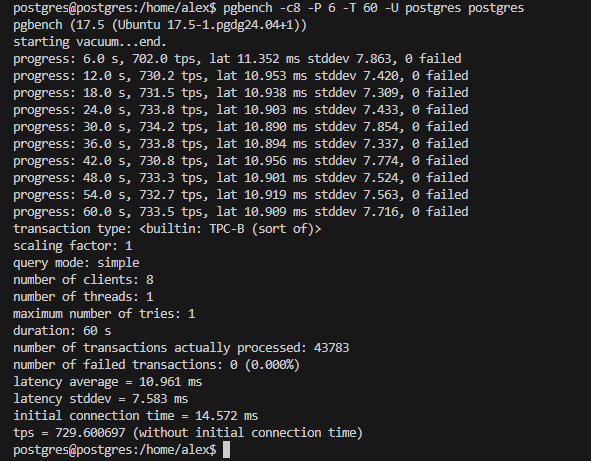

записать результат выполнения бенчмарка:

scaling factor: 1
query mode: simple
number of clients: 8
number of threads: 1
maximum number of tries: 1
duration: 60 s
number of transactions actually processed: 43783  
number of failed transactions: 0 (0.000%)
latency average = 10.961 ms
latency stddev = 7.583 ms
initial connection time = 14.572 ms
tps = 729.600697 (without initial connection time)

2. Настроить параметры vacuum/autovacuum.

SELECT name, setting, context, short_desc FROM pg_settings WHERE name like 'autovacuum%'; --- проверим текущие состояние и параметры для autovacuum (по умолчания в PostgresSQL autovacuum = on) 

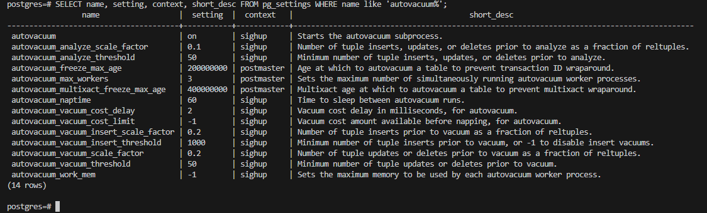

Проанализируем вывод и возьмем для настройки autovacuum следующие параметры:

autovacuum_vacuum_scale_factor ---для OLTP нагрузки рекоммендуют уменьшить до 0.01-0.05

autovacuum_vacuum_insert_threshold ---для OLTP нагрузки рекоммендуют увеличивать до 1000-10000 

autovacuum_max_workers   ---для OLTP нагрузки рекоммендуют увеличивать значение до 5-8. Оставим значение прежним так в системе используется 1vCPU

Для настройки будем использовать следущие команды:

ALTER SYSTEM SET autovacuum_vacuum_scale_factor = 0.01;

ALTER SYSTEM SET autovacuum_vacuum_threshold = 1000;

select pg_reload_conf(); --- перечитаем конфигурационный файл так как оба параметры имеют context=sighup

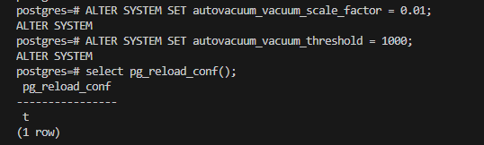

Показать что параметр применился

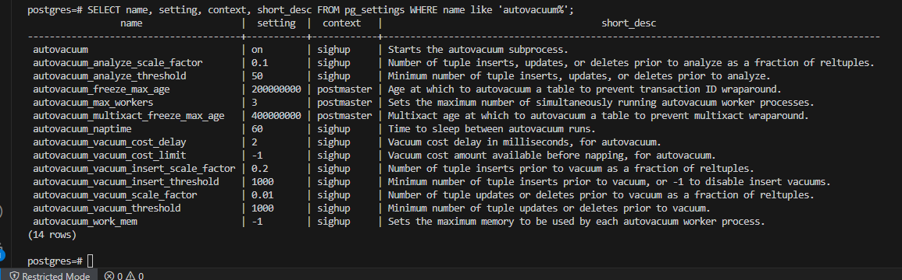

 3. Заново протестировать: pgbench -c8 -P 6 -T 60 -U postgres postgres и
сравнить результаты.

scaling factor: 1
query mode: simple
number of clients: 8
number of threads: 1
maximum number of tries: 1
duration: 60 s
number of transactions actually processed: 43700
number of failed transactions: 0 (0.000%)
latency average = 10.982 ms
latency stddev = 7.681 ms
initial connection time = 14.532 ms
tps = 728.273603 (without initial connection time)

Удалось ли улучшить производительность? Производительность немного упала.

 4. Создать таблицу с текстовым полем и заполнить случайными или 
сгенерированными данным в размере 1млн строк.

create table student as 
select 
  generate_series(1,1000000) as id,
  md5(random()::text)::char(10) as fio;

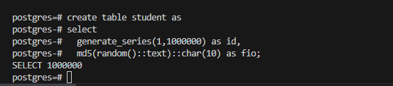

 5. Посмотреть размер файла с таблицей.
SELECT pg_size_pretty(pg_total_relation_size('student'));

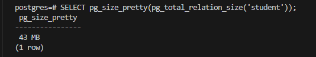

 
 6. Обновить все строчки 5 раз добавив к каждой строчке любой символ.

Выполним пять отдельных запросов на обновление талицы с добавлением символа.

ALTER TABLE student ALTER COLUMN fio TYPE varchar(15); --- предварительно, необходимо изменить тип столбца на более длинный, чтобы удалось добавит новый символ при обновлении

-- Первое обновление - добавляем символ 'A'
UPDATE student SET fio = fio || 'A';

-- Второе обновление - добавляем символ 'B'
UPDATE student SET fio = fio || 'B';

-- Третье обновление - добавляем символ 'C'
UPDATE student SET fio = fio || 'C';

-- Четвертое обновление - добавляем символ 'D'
UPDATE student SET fio = fio || 'D';

-- Пятое обновление - добавляем символ 'E'
UPDATE student SET fio = fio || 'E';

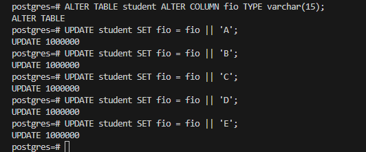

 7. Посмотреть количество мертвых строчек в таблице и когда последний раз 
приходил автовакуум.

SELECT relname, n_live_tup, n_dead_tup, trunc(100*n_dead_tup/(n_live_tup+1))::float "ratio%", last_autovacuum 
FROM pg_stat_user_TABLEs WHERE relname = 'student';

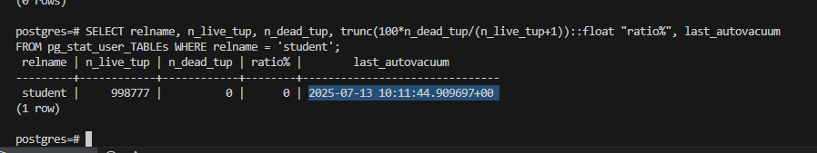

Объяснить почему такое количество мертвых строк получилось, сработал ли автовакуум и когда - при выводе команды получилось 0 мертвых строк, так как сработал автовакуум в  2025-07-13 10:11:44.909697+00:

 

8. Отключить Автовакуум на таблице и опять 5 раз обновить все строки.

ALTER TABLE student SET (
  autovacuum_enabled = false,
  toast.autovacuum_enabled = false
);  --- отключим autovacuum для таблицы student

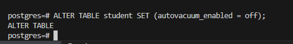

select pg_reload_conf(); ---перечитаем конфиг 

SELECT relname, reloptions 
FROM pg_class 
WHERE relname = 'student'; --- проверим настройки autovaccum, для таблицы student. Autovacuum отключен.

 relname |        reloptions        
---------+--------------------------
 student | {autovacuum_enabled=off}
(1 row)

Повторно обновим 5 раз таблицу,предварительно изменив тип столбца на более длинный

ALTER TABLE student ALTER COLUMN fio TYPE varchar(20);

-- Первое обновление - добавляем символ 'A'
UPDATE student SET fio = fio || 'A';

-- Второе обновление - добавляем символ 'B'
UPDATE student SET fio = fio || 'B';

-- Третье обновление - добавляем символ 'C'
UPDATE student SET fio = fio || 'C';

-- Четвертое обновление - добавляем символ 'D'
UPDATE student SET fio = fio || 'D';

-- Пятое обновление - добавляем символ 'E'
UPDATE student SET fio = fio || 'E';

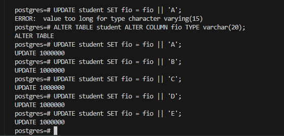

 9. Объяснить полученные результаты

Выполним команду и посмортрим количество мертвых строк в таблице student:
 SELECT relname, n_live_tup, n_dead_tup, trunc(100*n_dead_tup/(n_live_tup+1))::float "ratio%", last_autovacuum 
FROM pg_stat_user_TABLEs WHERE relname = 'student';

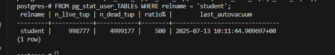

Так как был изменен параметр autovacuum = off в таблице student появилось большое количество мертвых строк = 4999177, что будет сказываться на размере таблицы на диске на ухудшении производительности при работе с данной таблицей.
Вывод: Лучшей и правильной практикой является не полное отключение Autovaccum, а правильная настройка его параметров под вашу нагрузку.
