1. Настройте сервер так, чтобы в журнал сообщений сбрасывалась 
информация о блокировках, удерживаемых более 200 миллисекунд. 

Чтобы настроить сервер данным образом необходимо включить следующие параметры:

log_lock_waits = on

deadlock_timeout = 200

Используем команды:

alter system set log_lock_waits = on;

alter system set deadlock_timeout = 200;

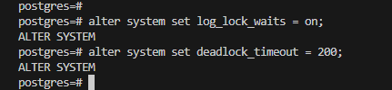

Чтобы применить изменения конфигурации выполним: 

SELECT pg_reload_conf();

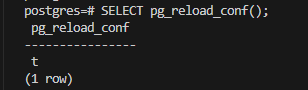

Проверим применились изменения параметрах командами:

show log_lock_waits;

show deadlock_timeout;

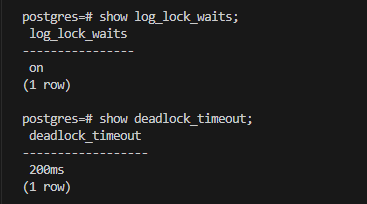

2. Воспроизведите ситуацию, при которой в журнале появятся такие 
сообщения.

Создадим таблицу:

CREATE TABLE accounts(
  acc_no integer PRIMARY KEY,
  amount numeric
);
INSERT INTO accounts VALUES (1,1000.00), (2,2000.00), (3,3000.00);

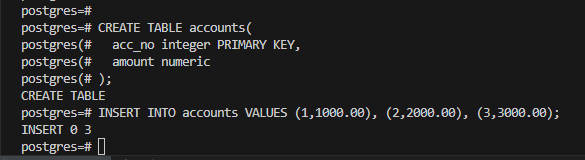

Воспроизведем блокировку:

Первая сессия:

BEGIN;
LOCK TABLE accounts IN ACCESS EXCLUSIVE MODE;  -- Удерживаем блокировку

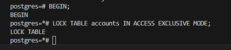

Вторая сессия:

BEGIN;
SELECT * FROM accounts FOR UPDATE;  -- Эта команда заблокируется

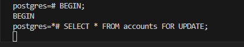

Посмотрим журнал в реальном времени:

sudo tail -f $(sudo -u postgres psql -c "SHOW data_directory;" -At)/log/postgresql-2025-07-16_195949.log

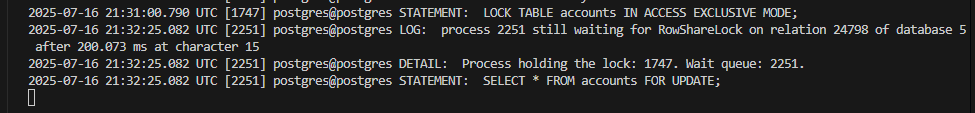

Видим, что появилось событие:

postgres@postgres LOG:  process 2251 still waiting for RowShareLock on relation 24798 of database 5 after 200.073 ms at character 15
2025-07-16 21:32:25.082 UTC [2251] postgres@postgres DETAIL:  Process holding the lock: 1747. Wait queue: 2251.

Транзакция 2251 ожидает RowShareLock для таблицы OID 22798 базы данных OID 5 после 200.073 ms (так задан бал параметр deadlock_timeout = 200;) 
Транзакция ожидает более 200 милисекунд, поэтому событие попало в журнал. Транзакция не может выполнится так как заблокирована таблица транзакцией 1747

 3. Смоделируйте ситуацию обновления одной и той же строки тремя 
командами UPDATE в разных сеансах.

Первая сессия:

BEGIN;
UPDATE accounts SET amount = amount - 100 WHERE acc_no = 1;

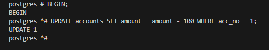

Вторая сессия:

BEGIN;
UPDATE accounts SET amount = amount - 200 WHERE acc_no = 1; 

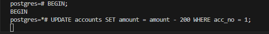

Третья сессия:

BEGIN;
UPDATE accounts SET amount = amount + 300 WHERE acc_no = 1;

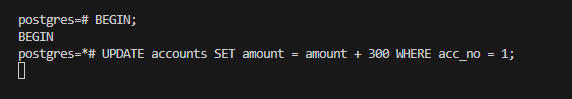

4. Изучите возникшие блокировки в представлении pg_locks и убедитесь, что 
все они понятны. 

Воспользуемся командой:

SELECT locktype, relation::REGCLASS, mode, granted, pid, pg_blocking_pids(pid) AS wait_for
FROM pg_locks WHERE relation = 'accounts'::regclass order by pid;

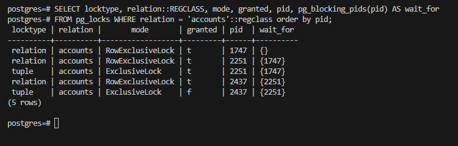

Проанализируем вывод:

Транзакция 1747 удерживает RowExclusiveLock на таблице accounts., блокировка получена granted = t, сама транзакция никем не блокируется wait_for {}, 
данная транзакция успешно выполнила update и удерживате блокировку таблице до завершения;

Транзакция 2251 получила уровень блокировки таблицы granted = t, но не может выполнить измения так как ждет пока 1747 снимет свою блокировку;

Транзакция 2251 также удерживает блокировку на строке locktype=tuple, но внести измения не может так как ждет снятия блокировки 1747;

Транзакция 2437 получила уровень блокировки таблицы granted = t, но не может выполнить измения так как ждет пока 2251 снимет свою блокировку;

Транзакция 2437 пытается получить эксклюзивнуб блокировки строки, но не может получить granted = f, транзакция не может изменить строку так как она заблокирована 2251.

5. Воспроизведите взаимоблокировку трех транзакций. 

Первая сессия:

BEGIN;
UPDATE accounts SET amount = amount - 100 WHERE acc_no = 1; Блокируем строку 1

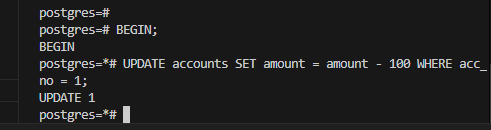

Вторая сессия:

BEGIN;
UPDATE accounts SET amount = amount - 200 WHERE acc_no = 2; Блокируем строку 2

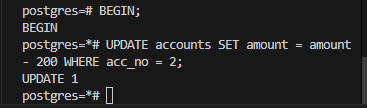

Третья сессия:

BEGIN;
UPDATE accounts SET amount = amount - 300 WHERE acc_no = 3; Блокируем строку 3

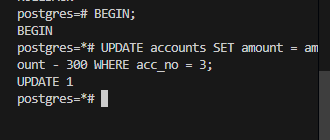

Затем,

Первая сессия:

UPDATE accounts SET amount = amount + 50 WHERE acc_no = 2; -- Ждёт Сеанс 2

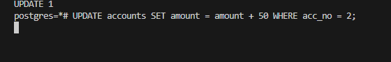

Вторая сессия: 

UPDATE accounts SET amount = amount + 75 WHERE acc_no = 3; -- Ждёт Сеанс 3

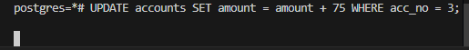

Третья сессия:

UPDATE accounts SET amount = amount + 100 WHERE acc_no = 1; -- Ждёт Сеанс 1

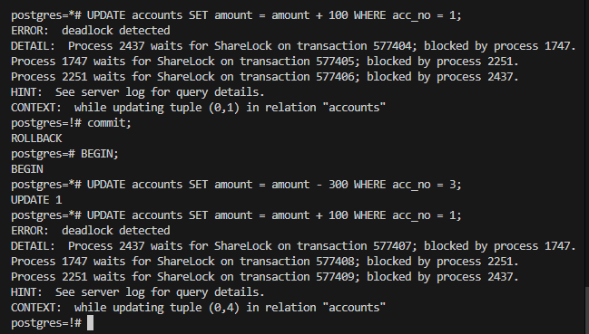

Завершается с ошибкой ERROR:  deadlock detected

6. Можно ли разобраться в ситуации постфактум, изучая журнал сообщений?

Да можно, если открыть лог файл то можно увидет в нем сообшения об ошибках - ERROR:  deadlock detected

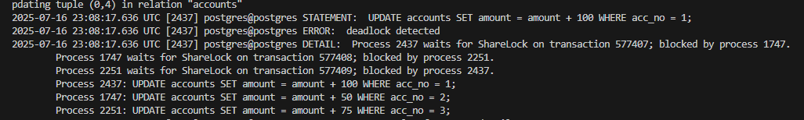

