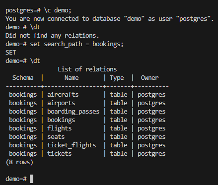

Для выполнения задания была установлена база данных demo c сайта https://postgrespro.ru/

1. Написать запросы поиска данных без индексов, посмотреть их план 
запросов.

Запрос 1

explain (costs, verbose, format json)
SELECT * FROM tickets WHERE book_ref = 'ABC123'; 

выполняется последовательное сканирование

Запрос 2

explain (costs, verbose, format json)
SELECT * FROM tickets WHERE passenger_id = 'ID1234567890';

выполняется последовательное сканирование

Запрос 3

explain (costs, verbose, format json)
SELECT * FROM tickets WHERE passenger_name LIKE 'Ivan%';

выполняется последовательное сканирование

Запрос 4

explain (costs, verbose, format json)
SELECT * FROM tickets WHERE contact_data->>'email' = 'user@example.com';

выполняется последовательное сканирование

Запрос 5

explain (costs, verbose, format json)
SELECT * FROM tickets 
WHERE passenger_name LIKE '%Petrov%' 
AND book_ref = 'DEF456';

выполняется последовательное сканирование

 2. Добавить на таблицы индексы с целью оптимизации запросов поиска 
данных.

analyze; выполним перед созданием для обновления статистики

-- Индекс по номеру бронирования
CREATE INDEX idx_tickets_book_ref ON tickets(book_ref);

-- Индекс по идентификатору пассажира
CREATE INDEX idx_tickets_passenger_id ON tickets(passenger_id);

-- Индекс по имени пассажира (для поиска по шаблону)
CREATE INDEX idx_tickets_passenger_name ON tickets(passenger_name varchar_pattern_ops);

-- GIN-индекс для JSON-поля
CREATE INDEX idx_tickets_contact_data ON tickets USING gin(contact_data);

-- Комбинированный индекс
CREATE INDEX idx_tickets_name_book_ref ON tickets(passenger_name, book_ref);

Проверим что наши индексы созданы.

 3. Сравнить новые планы запросов с предыдущими.

Запрос 1 с индексом

explain (costs, verbose, format json)
SELECT * FROM tickets WHERE book_ref = 'ABC123'; 

Видим, что в плане запроса теперь используется индекс и стоимость меньше чем при последовательном сканировании
 

Запрос 2 с индексом

explain (costs, verbose, format json)
SELECT * FROM tickets WHERE passenger_id = 'ID1234567890';

Видим, что в плане запроса используется индекс и стоимость меньше чем при последовательном сканировании

Запрос 3 с индексом

explain (costs, verbose, format json)
SELECT * FROM tickets WHERE passenger_name LIKE 'Ivan%';

Видим, что в плане запроса используется индекс и стоимость меньше чем при последовательном сканировании

Запрос 4 с индексом

explain (costs, verbose, format json)
SELECT * FROM tickets WHERE contact_data->>'email' = 'user@example.com';

При выполнение данного запроса индекс не используются - так как используется оператор "->>"

Выполним  такой же запрос, но поменяем оператор '->>' на @> чтобы проверить работу нашего индекса:
SELECT * FROM tickets WHERE contact_data @> '{"email": "user@example.com"}'

Теперь видим что используется индексное сканирование

Запрос 5 с индексом

SELECT * FROM tickets 
WHERE passenger_name LIKE '%Petrov%' 
AND book_ref = 'DEF456';

При выполнении запроса используется наш индекс стоимость выполнения запросы меньше, чем при выполнении последовательного сканирования

 4. Сравнить применение различных типов индексов.

Возьмем запрос выполним без индексов:

SELECT * FROM tickets 
WHERE contact_data->>'email' = 'user@example.com' 
AND passenger_name LIKE 'Ivan%';

Идет последовательное сканирование всей таблицы
Время выполнения: 222 ms

Создадим индекс B-Tree:
CREATE INDEX idx_passenger_name_btree ON tickets(passenger_name varchar_pattern_ops);

Выполним этот же запрос:

EXPLAIN ANALYZE SELECT * FROM tickets 
WHERE contact_data->>'email' = 'user@example.com' 
AND passenger_name LIKE 'Ivan%';

Видим, что используется индексное  b-tree сканирование
Время выполнения: 0.025 ms

Удалим B-tree;
Создадим индекс GIN:

CREATE INDEX idx_contact_data_gin ON tickets USING gin(contact_data);

Выполним запрос изменим оператора с ">>" на " @>" :

EXPLAIN ANALYZE SELECT * FROM tickets 
WHERE contact_data @> '{"email": "user@example.com"}' 
AND passenger_name LIKE 'Ivan%';

Видим что используется Bitmap Heap Scan и Bitmap Index Scan
Время выполнения 0.043 ms 

Удалим Gin индекс;
Создадим индекс составной B-tree:

CREATE INDEX idx_email_name_btree ON tickets 
((contact_data->>'email'), passenger_name);

Выполним запрос:

EXPLAIN ANALYZE SELECT * FROM tickets 
WHERE contact_data->>'email' = 'user@example.com' 
AND passenger_name LIKE 'Ivan%';

Видим  что используется Bitmap Heap Scan и Bitmap Index Scan (btree)
Время выполнения: 0.33

После выполнения команды analyze;

Время выполнения умешьлось до 0.023 ms

Выводы

Для разовых запросов на маленьких таблицах индексы могут не понадобиться, но для больших лучше стоит использовать

Для поиска по имени оптимален B-tree индекс с varchar_pattern_ops

Для гибкого поиска по jsonb лучше GIN индекс (но требует изменения запроса) в нашем тесте это не подтвердилось. 

Для фиксированных комбинаций условий составной B-tree индекс работает быстрее всего.

 

