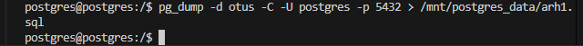
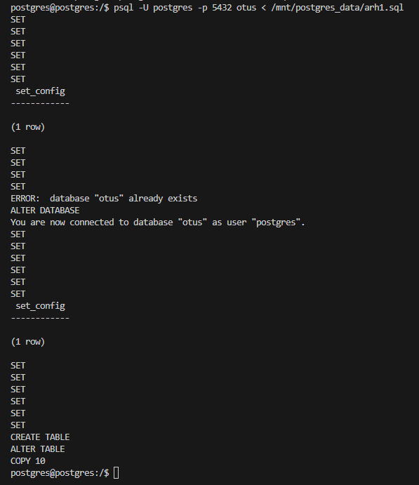

1. Создать бекапы с помощью pg_dump, pg_dumpall и pg_basebackup сравнить 
скорость создания и возможности.

Предварительно подготовим тестовую базу

Посмотрим существующие кластеры в Postgers:

pg_lsclusters

Создадим базу данных otus:

create database otus;

Создадим табличку student в базе данных otus:

\c otus

create table student as 
select 
  generate_series(1,10) as id,
  md5(random()::text)::char(10) as fio;

Проверим данные в таблице:

select * from student;

Сделаем бэкап при помощи pg_dump

Создадим директорию /mnt/postgres_data и предоставим права для пользователя Postgres

sudo mkdir /mnt/postgres_data
sudo chown postgres:postgres /mnt/postgres_data

В консоли Linux из под пользователя Postgres выполним команду для создания бэкапа:

pg_dump -d otus -C -U postgres -p 5432 > /mnt/postgres_data/arh1.sql 

Проверим создался ли файл с бекапом в директории:

ls -la /mnt/postgres_data/

Удалим таблицу student, проверим что таблица удалена: 

drop table student;
\dt

Выполним восстановление через psql

psql -U postgres -p 5432 otus < /mnt/postgres_data/arh1.sql

Проверим нашу таблицу c данными в базе данных otus

Восстановление таблицы studet выполнено успешно.

Используя pg_dump можно создать архив с нашим бэкапом:

Создадим бэкап и проверим:

pg_dump -d otus --create -U postgres -Fc -p 5432 > /mnt/postgres_data/arh1.gz 
ls -la /mnt/postgres_data/

Удалим базу otus целиком и выполним восстановление из архива при помощи pg_restore

Выполним восстановление через pg_restore , для успешного восстановления предварительно создадим базу otus:

Выполним восстановление:

pg_restore -d otus -U postgres -p 5432 /mnt/postgres_data/arh1.gz

Проверим:

Восстаноление из архива базы данных выполнено успешно.

Выполним бэкап и восстановление через pg_dumpall

Посмотрим количество существующих баз:

\l

Выполним полный бекап:

pg_dumpall -U postgres  -p 5432 > /mnt/postgres_data/backup_all.sql

Проверим создался ли бэкап:

Удалим базы данных otus и demo и выполним восстановление из backup_all:

drop database demo;
drop database otus;

Выполним восстановление:

psql -U postgres -p 5432 < /mnt/postgres_data/backup_all.sql

Восстановление было с ошибками:

Проверим одну из наших баз:

Перейдем в базу данных otus и проверим записи в таблице:

Восстановлнеие выполнено успешно.

Создадим атономоную копию  использую pg_basebackup

Проверим уровень ведения журнала, для создания автономной копии должен быть level=replica;

show wal_level; -

Cоздадим новый кластер:

sudo -u postgres pg_createcluster -d /var/lib/postgresql/17/main2 17 main2

Проверим существование 2 кластеров в Postres:

новый кластер выключен и поддерживает подключение по порту 5433

Удалим в кластере директорию main2:

rm -rf /var/lib/postgresql/17/main2

Проверим:

Создадим копию кластера main в main2 и проверим:

sudo -u postgres pg_basebackup -p 5432 -D /var/lib/postgresql/17/main2
sudo ls -la  /var/lib/postgresql/17/ 

Запускаем новый кластер и проверяем:

sudo -u postgres pg_ctlcluster 17 main2 start
pg_lsclusters

Мы создали идентичную реплику кластеру main, теперь у нас 2 одинаковых кластера с одниквыми бызами таблицами и физическими файлами 

Подключимся в консоли 1 к main в консоли 2 к main2 и проверим что клсатеры идентичны: 

Выводы: 

Для восстановления или переноса таблиц лучше пользоваться pg_dump 

Для восстаноления схем, нескольких баз данных вместе с логической структурой, лучше подходит pg_dumpall

А вообще данные инструменты резервирования и восстаноления удобно использовать в совкупности, при помощи pg_dump восстановить структуру кластера (схему табличное пространство, роли), а востановление баз производит через pg_dump, так получится быстрее из-за возможности параллельного выполнения процесса восстановления утилитой pg_dump. Также удобство утилит pg_damp и pg_dampall в том что они не приявязаны а архитектуре где развернут Posrtger - в качестве бэкапа создаю скрипт файл sql который можно открыть как в windows так и в Linux cистемах

Утилита pg_basebackup более мощный инструмент для создания бекапов, позволяет делать полную физическу копию кластера в горячем режиме (не останавливая работу с БД), сохраняя WAL файлы, которые меняются во время выполнения бекапа, pg_dumpall так не умеет.
Важной особенностью которую нужно учитывать при использваонии: pg_basebackup жестко привязан к архитектуре - версия ос, версия Postgres.

По скорости выполнения 1 место pg_dump из-за использования многопоточноти, но на маленькой базе конечно этого не заметно. pg_basebaсkup на одном уровне, модет ненмого быстрее pg_dumpall.

2. Настроить копирование WAL файлов.

Cоздадим директорию для wal файлов:

sudo mkdir /archive_wal

Предоставим права на директорию для пользователя Postgres:

sudo chown -R postgres:postgres /archive_wal

Проверим:

ls -la

Включим режим архивации:

ALTER SYSTEM SET archive_mode = 'on';
ALTER SYSTEM SET archive_command = 'test ! -f /archive_wal/%f && cp %p /archive_wal/%f';

Сделаем рестрат PostgresSQL:

sudo systemctl restart postgresql

Проверим настройки архивирования:

SELECT name, setting FROM pg_settings WHERE name IN ('archive_mode','archive_command','archive_timeout');

Создадим директорию для полного бекапа и предоставим права пользователю postgres, проверим:

sudo mkdir /full_backup
sudo chown -R postgres:postgres /full_backup
ls -la

Выполним команду для полного резервного копирования:

sudo -u postgres pg_basebackup -p 5432 -v -D /full_backup

В pgAdmin:

create table test (c1 text);

insert into test values ('Проверка восстановления с использованием WAL');

select now(); --- 2025-07-25 12:25:49.723279+00

Сделаем специальную ошибку, обновим все значения в поле fio
update student set fio = 'Иванова';

Для проверки можно выполнить команду: 

select * from student;

 

3. Восстановить базу на другой машине PostgreSQL на заданное время, 
используя ранее созданные бекапы и WAL файлы.

Останавливаем  Postgres:

sudo systemctl stop postgresql

Сохраним текущее состояние данных Postgres (на всякий случай). 
и пренесем данные:

sudo mkdir /old_data
sudo mv /var/lib/postgresql/17/main /old_data

Проверим что каталога main в Postgers нет:

sudo ls -la /var/lib/postgresql/17/

Воссоздадим каталог main:

sudo mkdir /var/lib/postgresql/17/main

Копируем в main полную резервную копию:

sudo cp -a /full_backup/. /var/lib/postgresql/17/main

В восстановленной резервной копии нужно почистить каталог pg_wal:

sudo rm -rf /var/lib/postgresql/17/main/pg_wal/*

и скопировать в этот каталог последний вариант WAL:

sudo cp -a /old_data/main/pg_wal/. /var/lib/postgresql/17/main/pg_wal

Редактируем файл конфигурации:

sudo nano /etc/postgresql/17/main/postgresql.conf

restore_command = 'cp /archive_wal/%f "%p"' (команда должна быть строго обратной команде на архивирование WAL )

recovery_target_time = '2025-07-25 12:25:49.723279+00' (то время, которое мы зафиксировали).

Затем создаем пустой файл recovery.signal:

sudo touch /var/lib/postgresql/17/main/recovery.signal

меняем владение и права на каталог main с подкаталогами:

sudo chown -R postgres:postgres /var/lib/postgresql/17/main/
sudo chmod -R 750 /var/lib/postgresql/17/main/

И запускаем сервер:
sudo systemctl start postgresql

6.	Проверяем в клиенте, что таблица test в базе данных восстановлена:
select * from test;

И ошибочный update в таблице student отменен:
select * from student;

7.	После всех проверок можно открыть доступ к серверу не только на чтение, но и на запись:
select pg_wal_replay_resume();

