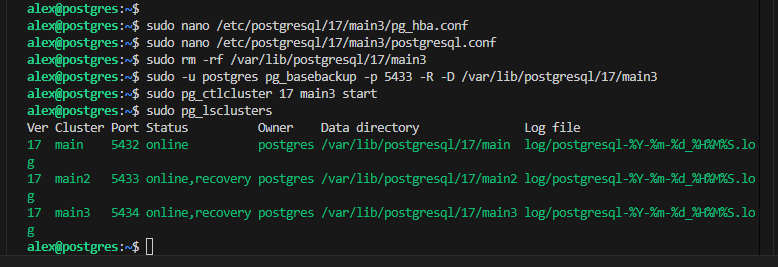

1. Настроить физическую репликацию между двумя нодами: мастер - слейв.

Проверим существующие кластеры:
sudo pg_lsclusters

Подключимся к сущетвующему кластеру, проверим существующие бд, посмотрим в бд otus таблицы и посмотрим данные в таблице:
sudo -u postgres psql -p 5432
\l
\c otus
\dt 
select * from student;

Теперь проверим уровень текущий уровень журнала WAL, для физической репликации уровень необходим wal level = replica

show wal_level;

Добавим в pg_hba.conf строку для подключения репликации:

sudo nano /etc/postgresql/17/main/pg_hba.conf

host    replication     all             0.0.0.0/0               scram-sha-256

и перечитаем конфиг:

SELECT pg_reload_conf();

Проверим параметры файла postgres.conf - нам необходимо чтобы слушались все ip адреса (для нашего тестового стенда)

sudo nano /etc/postgresql/17/main/postgresql.conf

Создадим 2 кластер main2:

sudo pg_createcluster -d /var/lib/postgresql/17/main2 17 main2

Аналогично с первым кластером выставим параметры для подключения в файлах:

sudo nano /etc/postgresql/17/main2/pg_hba.conf
sudo nano /etc/postgresql/17/main2/postgresql.conf

Удалим папку main2 на втором кластере:

sudo rm -rf /var/lib/postgresql/17/main2

Сделаем бекап нашего первого кластера в папку main2:

sudo -u postgres pg_basebackup -p 5432 -R -D /var/lib/postgresql/17/main2

Запускаем второй кластер:

sudo pg_ctlcluster 17 main2 start

Проверим состояние кластеров:
sudo pg_lsclusters

Видим, что второй кластер работает в режиме реплика для чтения + восстановление (17  main2   5433 online,recover)

Провереим состояние репликации на main (мастере):

SELECT * FROM pg_stat_replication \gx

Проверим состояние на реплике main2

select * from pg_stat_wal_receiver \gx
select pg_last_wal_replay_lsn();

Из данных выводов видим что наша реплика настроена в асинхронном режиме и синхронизирована с мастером, так как 
(sent_lsn = write_lsn = flush_lsn = replay_lsn).

Чтобы убедится что репликация работает, добавим занчение в таблицу student test_repl на мастере main и проверим что это значение появится на реплике main2:

2. Настроить каскадную репликацию со слейва на третью ноду.

Проверим уровень жарнала WAL на main2:

show wal_level;

Создадим тертий кластер main3

Создадим 3 кластер main3:
sudo pg_createcluster -d /var/lib/postgresql/17/main3 17 main3

Аналогично с main и main2 настроим параметры:

sudo nano /etc/postgresql/17/main3/pg_hba.conf

sudo nano /etc/postgresql/17/main3/postgresql.conf

Удалим папку main3 на третьем кластере:

sudo rm -rf /var/lib/postgresql/17/main3

Сделаем бекап с реплики main2 в папку main3:

sudo -u postgres pg_basebackup -p 5433 -R -D /var/lib/postgresql/17/main3

Запустим третий кластер main3:

sudo pg_ctlcluster 17 main3 start

Проверим состояние кластеров:

sudo pg_lsclusters

Видим что main2 main3 работают в режиме реплика + восстановление

Проверим работает ли каскадная репликация: добавим на мастере main значение test_cas_r в таблицу student, изменения в таблице student также должны произойти на main2 и main3

insert into student values(12, 'test_cas_r');

Видим, что значение 'test_cas_r' появилась во всех таблицах student на main2 и main3. Каскадная репликация работает.

3. Настроить логическую репликацию таблицы с мастер ноды на четвертую 
ноду.

Сделаем публикацию таблицы student с main на main4

Создадим 4 кластер main4:

sudo pg_createcluster -d /var/lib/postgresql/17/main4 17 main4

Запустим 4 кластер main4:

sudo pg_ctlcluster 17 main4 start

Подключимся к кластеру:

sudo -u postgres psql -p 5435

Настроим параметры подключения и сделаем рестарт:

sudo nano /etc/postgresql/17/main4/pg_hba.conf

sudo nano /etc/postgresql/17/main4/postgresql.conf

ALTER SYSTEM SET wal_level = logical;

sudo pg_ctlcluster 17 main4 restart

Создадим базу данных таблицу student в базе данных otus схожую по структуре и удалим данные из таблицы:

create database otus;

create table student as 
select 
  generate_series(1,10) as id,
  md5(random()::text)::char(10) as fio;

TRUNCATE TABLE student;

Перейдем на кластер main и сделаем публикацию таблицы student

CREATE PUBLICATION test_pub FOR TABLE student;

Postres ругнулся и попросил изменить уровень журнала WAL

Меняем wal_level и перезагружаем кластер

ALTER SYSTEM SET wal_level = logical;

sudo pg_ctlcluster 17 main restart

 show wal_level;

Прверим созданную публикацию:

\dRp+

Перейдем в main4 и создадим подписку:

CREATE SUBSCRIPTION otus_sub 
CONNECTION 'host=localhost port=5432 user=postgres password=12345 dbname=otus' 
PUBLICATION test_pub WITH (copy_data = true);

Проверим подписку:

\dRs

SELECT * FROM pg_stat_subscription \gx

Проверим:

select * from student;

Проверим работает ли все вместе всмести 

Выполним на мастере:

insert into student values(13, 'all_rep');

